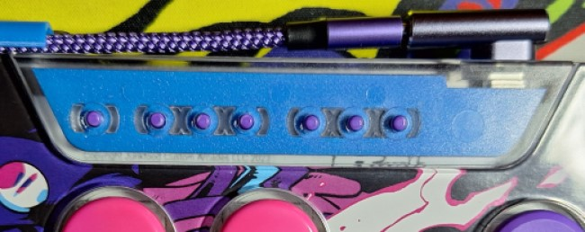
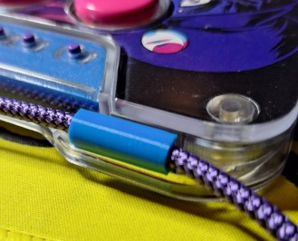

# snackbox-mods
Designs &amp; modifications I have made for my snackbox micro controller v2. Compatibility not tested on other models; please submit a PR/Issue if you test on a different model!

## Accent Color Insert

Print flat. Doubles as a silencer for the rattling of my menu buttons. Can also be used to add art to the menu button area with the matching dxf (not yet tested).

## Cable Clip

Print on end to avoid collapse of the snap clip.

## Footer ##
All designs CC-BY-NC, see license file.